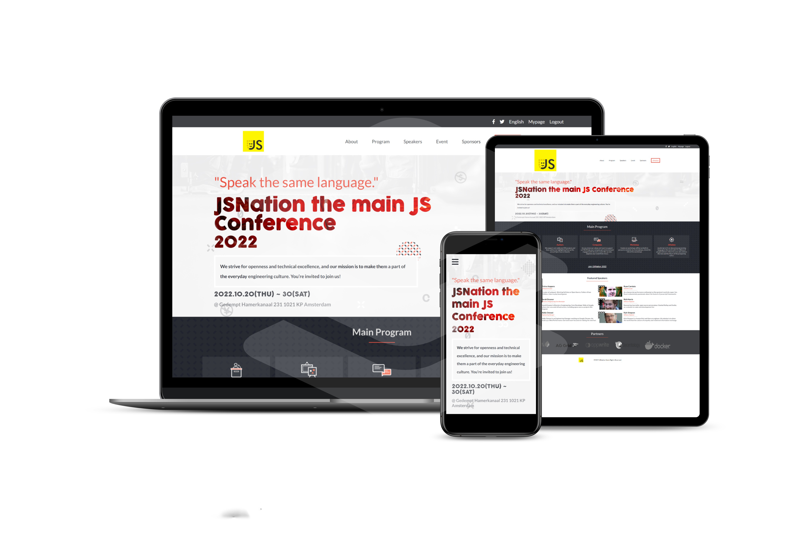

# JSNation Conference Page 2022
Javascript Nation (JSNation) is a 2-day 2-track event focusing exclusively on JavaScript development. It aims to discover the future of the JavaScript development ecosystem and connect to its stellar crowd! It is the biggest Javascript conference Worldwide.

## Built With
- HTML5, CSS3 and JavaScript
- Github and Git
- Linter
    - Lighthouse
    - Webhint
    - Stylelint
    - Eslint 
## Project Documentation 

The link to my [ record a video](https://www.loom.com/share/19cd6f6f01f44b3d83a22cf871428091)

## Website Mockup :iphone: :computer:

## Live Demo 

[Live Demo Link](https://miliyonayalew.github.io/JSNation/)

## Author

👤 **Miliyon Ayalew**

- GitHub: [@Miliyonayalew](https://github.com/Miliyonayalew/)
- Twitter: [@MilaAyalew](https://twitter.com/MilaAyalew)
- LinkedIn: [@miliyon-ayalew](https://www.linkedin.com/in/miliyon-ayalew-210808131/)

## 🤝 Contributing

Contributions, issues, and feature requests are welcome!

Feel free to check the [issues page](../../issues/).

## Show your support

Give a ⭐️ if you like this project!

## Acknowledgments

- Inspiration 

- The [Creative Commons license of the design](https://creativecommons.org/licenses/by-nc/4.0/)

- Original design idea by [Cindy Shin in Behance](https://www.behance.net/adagio07)..
- JSNation

## 📝 License

This project is [MIT](./LICENSE) licensed.
